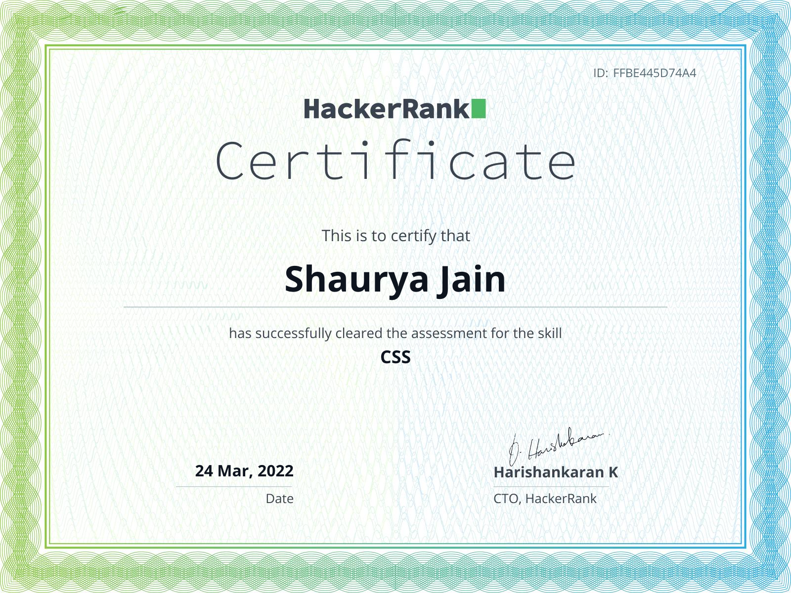
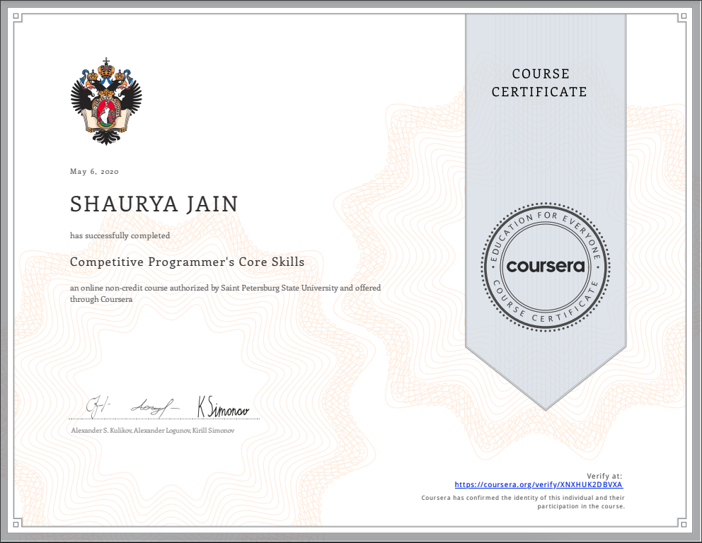

# Certifications and Others :

## Online Profiles :

**HackerRank :**  https://www.hackerrank.com/shaurya_jain_em1

## Badges :

## Certifications :

### WEB :

* HTML-CSS :
      
       1. Responsive Web Design - FreeCodeCamp.
       2. CSS - HakerRank.
      
* JavaScript :

       1. JavaScript (Basic) Certificate - HackerRank.
       2. JavaScript (Intermediate) Certificate - HackerRank.
       3. Javascript Algorithms And Data Structures - FreeCodeCamp.
       4. Infosys Certified JavaScript Developer - Infosys.

 
Web Certifications With Links

   

 

 
Link : </strong> <a href="https://www.freecodecamp.org/certification/Shaur_Jain/responsive-web-design">
 https://www.freecodecamp.org/certification/Shaur_Jain/responsive-web-design
 </a>

 
 

 
Link : </strong> <a href="https://www.hackerrank.com/certificates/ffbe445d74a4">
 https://www.hackerrank.com/certificates/ffbe445d74a4
 </a>

 
 

 
Link : </strong> <a href="https://www.hackerrank.com/certificates/21a7f89be15a">
 https://www.hackerrank.com/certificates/21a7f89be15a
 </a>

 
 

 
Link : </strong> <a href="https://www.hackerrank.com/certificates/5c97ac1442f1">
 https://www.hackerrank.com/certificates/5c97ac1442f1
 </a>

 
 

 
Link : </strong> <a href="https://www.freecodecamp.org/certification/Shaur_Jain/javascript-algorithms-and-data-structures">
 https://www.freecodecamp.org/certification/Shaur_Jain/javascript-algorithms-and-data-structures
 </a>

 
  

### Oracle Cloud :
    
    1. Oracle Cloud Service Sales Specialist.
    2. Oracle Cloud Service Solution Engineer Specialist.
    

 
Certifications With Links

    
  

  

  
Link : </strong> <a href="https://www.credly.com/badges/2263f887-2111-4527-b4b1-95a56564a0ea ">
https://www.credly.com/badges/2263f887-2111-4527-b4b1-95a56564a0ea 
 </a>

### Coursera :
     
     1. Competitive Programmer's Core Skills.
     

 
Certifications With Links

   
 

 
Link : </strong> <a href="https://www.coursera.org/account/accomplishments/certificate/XNXHUK2DBVXA">
https://www.coursera.org/account/accomplishments/certificate/XNXHUK2DBVXA
 </a>

 

Thank you for visiting.

